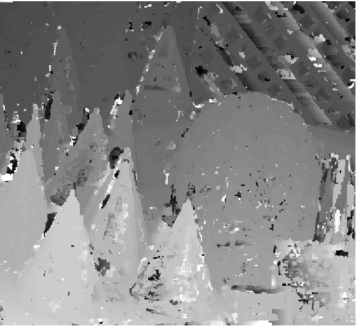
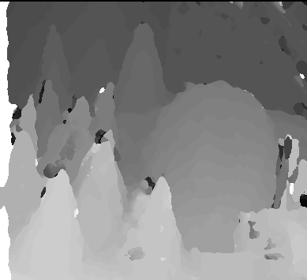

# MatLab-Stereo-Matching
Stereo matching of two rectified images using squared absolute difference and Markov belief propagation.

Model the problem as a markov random field:

- Observable variable are the pixel intensity values
- The hidden labels, aka disparities, form the field 

Initial guess comes from SAD local estimate of the disparities;
Belief propagation smooths the disparity map using a smoothness cost function and data cost function:

- Smoothness cost: penalizes labels that are very different between two adjacent pixels.
- Data cost: implemented as the SAD; penalizes labels that give high SAD from the observable pixel intensities.

USAGE:

Call stereo_disparity_best(Il, Ir, bbox) with left and right rectified images, and an image ROI:

- First iteration depth map, using only squared absolute difference matching

- Final depth map after 10 iterations of belief propagation
